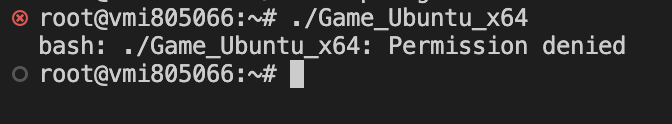
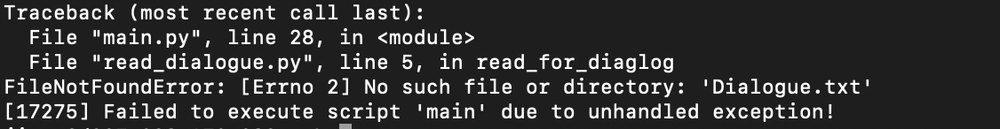
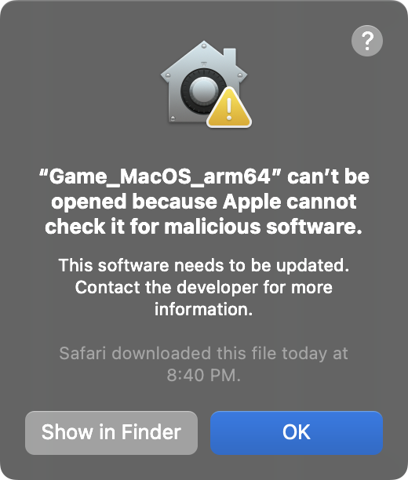

<p>Hello! This repo is for 2023 spring mountain madness team including: <br>  
Xander Smith (xws)<br>  
Jimmy Chui (kyc46)<br>  
Jonathan Peters (jmp22) <br>  
</p>

# The Game

<p>
This is a text-based dungeon/adventure game, titled "LOST IN TRANSLATION"
Here is a short synopsis:
  
You are stuck in a mysterious and oftentimes bizzare land. It is full of strange creature and even stranger locations. Even the language that the locals speak is unintelligable to you. It is perhaps a French dialect. Nevertheless, you must attempt to translate the useful tips the locals will give you. Unfortuntely, your GENERIC TRANSLATE APP is corrupted and does not translate properly. To debug, you must solve puzzles. The accuracy of the resulting translation depends on your puzzle-solving proficiency. 

Beware of unscrupulous creatures luring you to certain death. But, play it too safe, and you could become forever lost.


</p>

# How to use the released package

<p>
  
For linux (Ubuntu and Debian) and MacOS (intel or Apple Silion):
To run this game properly, first download the folder from the release section, then unzip it. Due to the limitation of the system struture, you have to     manually access the folder from the terminal, by typing the following command.
    
    #relapce "where-you-put-the-folder" and "downloaded-folder-name" with actual value
    cd /where-you-put-the-folder/downloaded-folder-name/

    #if you are using debian or ubuntu
    ./Game_Ubuntu_x64

    #if you are using MacOS (apple silicon)
    ./Game_Macos_arm64
  

  Or by dragging (no need to type the looooong path)
  
  
  
  Then type
  
  ```
  ./Game_Macos_arm64
  ```
 
  
For Windows user, just download and click the .exe file. No extra step needed.
 
For the best experience, please turn your terminal window to fullscreen mode.
 
</p>

# How to run the game from source

<p>
  
Download or clone the source code. Make sure python is correctly installed on your computer.
Check for dependancy belowby running the code (if colorama is not installed, running below comand will make sure it installed)
```
pip install colorama
```
After that, run:
```
python main.py
```


</p>

# How to compile the game from source

<p>

Download or clone the source code. Make sure python is correctly installed on your computer.
Check for dependancy belowby running the code (if colorama or PyInstaller is not installed, running below comand will make sure it installed)
```
pip install colorama pyinstaller
```
After that, run:
```
python -m PyInstaller --onefile main.py
```
</br>
video tutorial
<href>https://youtu.be/7yDT9fxT4xY<href>
</br>

</p>

# Common issues

<p>

1. Permisson issue (on linux) </br>
</br>
You can execute this command
```
chmod 777 ./Game_Ubuntu_x64
``` 
</br>

2. FileNotFoundError: [Errno 2] No such file or directory: 'xxxx.txt'
</br>
Plase make sure you have cd into the game directory, then run the execuatble.
</br>

3. "Game_MacOS_arm64" can't be opened because Apple cannot check it for malicious software. </br>
</br></br>

Go to setting, type privacy on the search bar, click "Privacy & security", scroll to the bottom, click "Allow Anyway", enter your user password, then follow the instructions for linux (Ubuntu and Debian) and MacOS (intel or Apple Silion) again.

</br></br>

